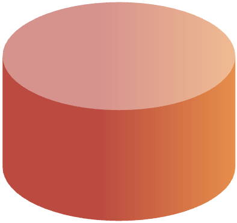

```{r include=FALSE}
library(metathis)
library(glue)
library(xaringanExtra)
library(haven)
library(readr)
library(dplyr)
library(knitr)
library(withr)
library(htmltools)
setwd("/Users/riley/STOR 496")
xaringanExtra::use_tile_view()
xaringanExtra::use_share_again()
xaringanExtra::use_broadcast()
xaringanExtra::use_scribble(pen_color = "#a4c4f4", pen_size = 8, eraser_size = 30)
#xaringanExtra::use_animate_all("slide_up")
xaringanExtra::use_fit_screen()
```

class: center, middle

<a href="https://branelab.web.unc.edu/" target="_blank">
  
</a>

# **Substance Use Disorder**

### *SUD*

##a treatable mental disorder that affects a person's brain and behavior, leading to their inability to control their use of substances like legal or illegal drugs, alcohol, or medications

---
<a href="https://branelab.web.unc.edu/" target="_blank">
  
</a>

#Original Data

```{r, echo=FALSE, message=FALSE, include=FALSE}
setwd("/Users/riley/STOR 496")
#replace with your filename
filename <- "defrtdata_original_RH"
sav <- read_sav(paste0("./", filename, ".sav"))
#getwd() # this is the folder it will save into unless you specify otherwise in the path below
write_csv(x = sav, file = paste0("./", filename, ".csv"))
data <- read_csv(paste0("./", filename, ".csv"), show_col_types = F)
merged_data <- data %>%
  group_by(record_id) %>%
  summarize_all(list(~ first(.[!is.na(.)])))
```

```{r}
knitr::kable(merged_data[1:2, c(1, 9, 50:ncol(merged_data))], format = "html")
```

---
<a href="https://branelab.web.unc.edu/" target="_blank">
  
</a>
#New Data EDA


---
<a href="https://branelab.web.unc.edu/" target="_blank">
  
</a>
#New Data EDA cont.


---
<a href="https://branelab.web.unc.edu/" target="_blank">
  
</a>
#**Research Question**
###1. Are certain SUDs better able to predict craving?
###2. Are certain SUDs more likely to lead to a relapse, and does the intensity of craving account for this?
###3. How does an individual's number of SUD symptoms predict substance use severity?

---
<a href="https://branelab.web.unc.edu/" target="_blank">
  
</a>
##Methodology
<ol>
1. Clean the data by determining which individuals possess all or mostly NA values and, potentially, impute these values to prevent the loss of observations. Also, adjust for data collection or input error. <br><br>
2. Assess the data and determine how many SUD there will be to track. <br><br>
3. Determine which individuals possess a single SUD, these individuals will be used as a control when comparing their data against those who are afflicted with mutliple SUD, a common theme in addiction. <br><br>
4. Build a model. Start with the intercept only-most simple model-and begin to work towards more relevant seeming models such as linear or logistic regression. <br><br>
5. Discuss which tests are relevant for this type of analysis with an n of only ~200 such as ANOVA, stepwise selection, and Cook's Distance. <br><br>
6. Attempt a classification model such as LDA, QDA, or ML algorithm. <br><br>
</ol>

---
<a href="https://branelab.web.unc.edu/" target="_blank">
  
</a>
##Methodology cont.

<ol>
7.  Assess the model's level of performance first by generating a confusion matrix and then by calculating sensitivity and specificity. <br><br>
8. Pick the best model and interpret the results in the context of SUD <br><br>
</ol>

---
class: center
<a href="https://branelab.web.unc.edu/" target="_blank">
  
</a>
#Progress

<div style="position: absolute; bottom: 150px; left: 100px;">
  
  <div style="position: absolute; bottom: 141px; left: 0; width: 106px; text-align: center; z-index: 1;">
    <p style="font-size: 16px; color: #2596be; font-weight: bold;">50%</p>
  </div>
</div>
<div style="position: absolute; bottom: 375px; left: 101px;">
  
</div>
<div style="position: absolute; bottom: 150px; left: 101px;">
  
  <div style="position: absolute; bottom: -60px; left: 0; width: 106px; text-align: center;">
    <p style="font-size: 16px; color: #2596be;">Performing EDA</p>
  </div>
</div>
<div style="position: absolute; bottom: 150px; left: 250px;">
  
  <div style="position: absolute; bottom: 111px; left: 0; width: 106px; text-align: center; z-index: 1;">
    <p style="font-size: 16px; color: #584d9c; font-weight: bold;">0%</p>
  </div>
</div>
<div style="position: absolute; bottom: 325px; left: 251px;">
  
</div>
<div style="position: absolute; bottom: 150px; left: 251px;">
  
  <div style="position: absolute; bottom: -60px; left: 0; width: 106px; text-align: center;">
    <p style="font-size: 16px; color: #584d9c;">Clean the Data</p>
  </div>
</div>
<div style="position: absolute; bottom: 150px; left: 400px;">
  
  <div style="position: absolute; bottom: 111px; left: 0; width: 106px; text-align: center; z-index: 1;">
    <p style="font-size: 16px; color: #942c7c; font-weight: bold;">0%</p>
  </div>
</div>
<div style="position: absolute; bottom: 325px; left: 401px;">
  
</div>
<div style="position: absolute; bottom: 150px; left: 401px;">
  
  <div style="position: absolute; bottom: -60px; left: 0; width: 106px; text-align: center;">
    <p style="font-size: 16px; color: #942c7c;">Build the Models</p>
  </div>
</div>
</div>
<div style="position: absolute; bottom: 150px; left: 550px;">
  
  <div style="position: absolute; bottom: 111px; left: 0; width: 106px; text-align: center; z-index: 1;">
    <p style="font-size: 16px; color: #b42c14; font-weight: bold;">0%</p>
  </div>
</div>
<div style="position: absolute; bottom: 325px; left: 551px;">
  
</div>
<div style="position: absolute; bottom: 150px; left: 551px;">
  
  <div style="position: absolute; bottom: -60px; left: 0; width: 106px; text-align: center;">
    <p style="font-size: 16px; color: #b42c14;">Assess Performance</p>
  </div>
</div>
<div style="position: absolute; bottom: 150px; left: 700px;">
  
  <div style="position: absolute; bottom: 111px; left: 0; width: 106px; text-align: center; z-index: 1;">
    <p style="font-size: 16px; color: #cc7004; font-weight: bold;">0%</p>
  </div>
</div>
<div style="position: absolute; bottom: 325px; left: 701px;">
  
</div>
<div style="position: absolute; bottom: 150px; left: 701px;">
  
  <div style="position: absolute; bottom: -60px; left: 0; width: 106px; text-align: center;">
    <p style="font-size: 16px; color: #cc7004;">Discuss Results</p>
  </div>
</div>

